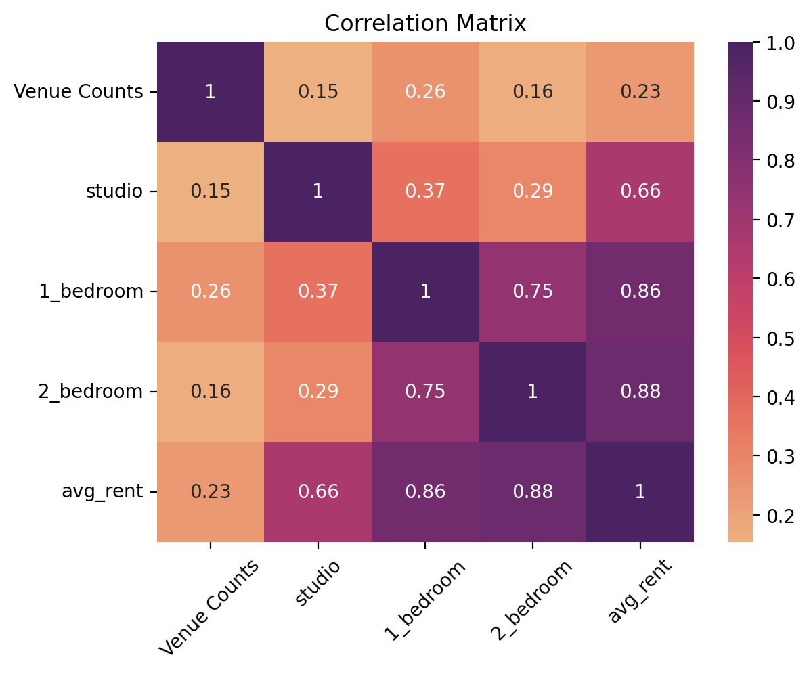
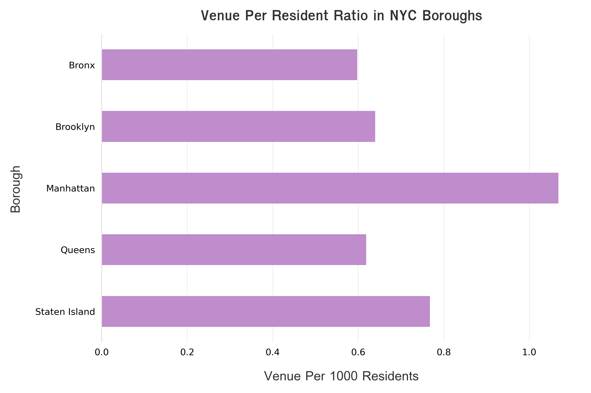

# Clustering NYC Neighborhoods
<p style="text-align: center;"><b> Midterm project - LHL Data Science Bootcamp </b></p>


_Figure credit: [Emiliano Bar](https://unsplash.com/photos/kheTI8pIywU?utm_source=unsplash&utm_medium=referral&utm_content=creditShareLink)_

## Introduction
In this project, we aimed to segment neighborhoods in New York City (NYC) into different clusters based on the availability of healthcare services. 

Different clustering models from the Scikit-Learn package were used, such as the K-means algorithm, hierarchichal clustering and DBScans. Venue information was obtained using the Foursquare API. Geolocation and populational information was obtained from the [NYC Open Data](https://data.cityofnewyork.us/) database. Rental cost information was sourced from [Zumper](https://www.zumper.com/rent-research/new-york-ny) and [CityRealty](https://www.cityrealty.com/nyc/market-insight/rental-building-offers/battery-park-city/map-average-nyc-rent-prices-july-2020-21-buildings-offering-free-rent/45084).

The ```src``` folder contains the code used during the data processing, modelling and figure generation steps. Raw and processed .csv files can be found in the ```data``` folder. Finally, the resulting submission.csv file containing neighborhoods and respective cluster labels can be found in the ```output``` folder, as well as figures and maps generated during the data exploration and visualization steps.  

## Data Acquisition
Geolocation on each NYC neighborhood was obtained from a [Neighborhood Names GIS file](https://drive.google.com/file/d/16hGHxuPHDVVwlHhiZ5pFoNMfmGjh_JYb/view?usp=sharing). After acquiring the coordinates for each neighborhood, GET requests were sent to the Foursquare API to get venue information within a 500 m radius for each neighborhood. Focus was given to health and medicine-related locations, but data for arts & entertainment and government/public facilities is also available in the ```data``` folder. 

Economic information relates to the [average](https://drive.google.com/file/d/17kDaedI8cBoZz8rKY7yZ0N-QNSLChQWR/view?usp=sharing) and [median](https://drive.google.com/file/d/1EyXSpnV--2iYmYzlGZmMgonbW9jzJdcv/view?usp=sharing) house pricing for different neighborhoods in NYC in different years. Some of the median prices had to be estimated since there was missing information for 1-Bedroom and Studio apartments. The rent price data was merged with the other datasets by using neighborhood as a merging point. 

Populational data is from two census that took place on different years (2000 and 2010). The data includes borough and neighborhood information. Since the neighborhoods are grouped for tabulation purposes, only the borough was used to connect populational data with healtcare service information. 

## Findings Summary

Different features were used for clustering the neighborhoods. The most interesting method was grouping neighborhoods that have similarities in their top 5 most common healthcare facility types. The resulting clustering can be seen in a map (snippet shown below). For this clustering, the KMeans algorithm was used. To visualize the clusters in an intercative map, please download the [HTML file](/output/Most_Common_Category_Clusters.HTML) and open it with preferred browser.

[](/output/Most_Common_Category_Clusters.HTML).

The relationship between rent price and access to healthcare was evaluated with the help of a correlation matrix. To do that, the median rent price data was used since it included more neighborhoods. An average rent price by neighborhood could be calculated, and this feature was used to look at the correlation. It was found that the number of healthcare facilities is weakly correlated to the average rent price in a given neighborhood.



Another interesting aspect to consider is the availability of healthcare facilities in the each borough. As can be seen in the image below, Manhattan has the highest offering of facilities per 1000 residents. A possible explanation is that this borough is perhaps the most visited and most businesses/offices out of all boroughs, so a large number of hospitals, offices and other businesses have long been established there. This may also be correlated to the high rent prices in Manhattan - the population there is not as large since rent is not affordable, and that could affect the venue per residents ratio. 

It is also interesting to notice that Staten Island comes in second in availability of venues per resident. In this case, a possible explanation is that due to the fact this borough is an island. It would be inconvenient or even dangereous to leave to the other boroughs in case of an emergency. This may also have attracted other healthcare-related practitioners to establish themselves on the island - the benefit of not having to drive far may be very appealing to some patients.



Additional relationships can be found by navigating the repo. More specifically, it is interesting to see how other clustering methods (DBScans and hierarchical clustering) performed. 

## Conclusion

Using data from the NYC Open Data database, Foursquare and other sources, we were able to cluster different NYC neighborhoods using different approaches. The most interesting findings were obtained using KMeans clustering (cluster by most frequent categories and by total venue count). It was possible to draw a relationship between economic (rent price) and demographic (borough population) factors and the healthcare facilities in each region in NYC (neighborhood/borough). 